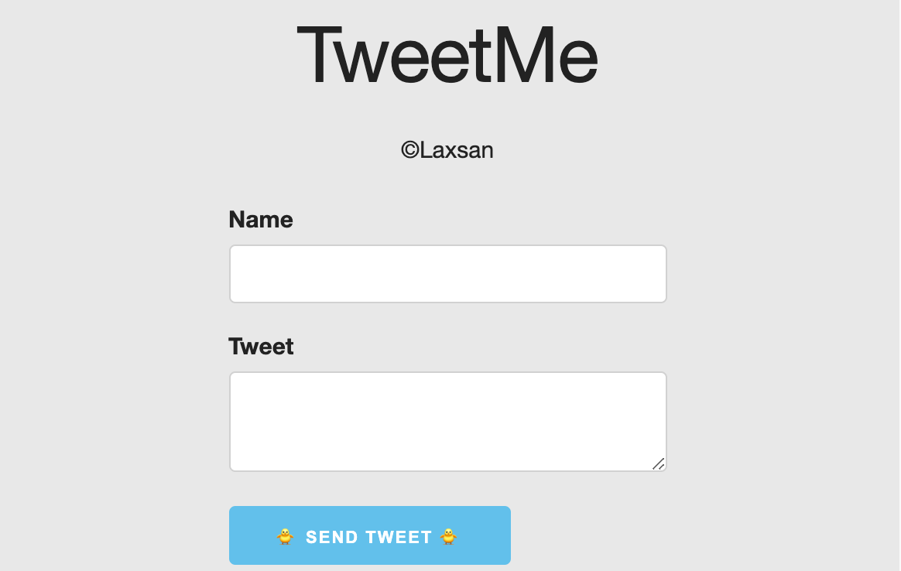

# TweetMe
## App to demonstrate a FULL STACK 🥞 (Client, Server, DBs).
### App to demonstrate System Design also.

#### Features :
* Anyone can send me a message 📩
* All tweets sent are visible by everyone 🗣.

## Objectives

* [ ] 📝 System Design Diagram of Stack
* [ ] 🔎 Explain between Client and Server
* [ ] ⌨️ Get user input from Client
* [ ] ➡ Send input to to Server from Client with fetch to Server
* [ ] 📀 Store data in DB
* [ ] 🔎 Retrieve data from DB on Server 
* [ ] ⬅️ Retrieve data from Server on Client using fetch
* [ ] 🙈 Hide/Show element (UI client side)
* [ ] ➕ Add element to client side
* [ ] 🚀 Deploy Client online
* [ ] 🚀 Deploy DB online
* [ ] 🚀 Deploy Server online

## Front-end Stage 1

* [x] Create client folder
* [x] Setup index.html
* [x] Bring in external CSS :
  * http://getskeleton.com/
  * https://cdnjs.cloudflare.com/ajax/libs/skeleton/2.0.4/skeleton.min.css
* [x] Create header
* [x] Create form
  * [x] Name
  * [x] Content
  * [x] u-full-width to both inputs
* [x] Get the form submit
* [x] Hide the form
* [x] Show loading GIF
* [x] Get data from form
* [x] Get user input from client
* [x] Hide/Show elements (UI client side)

## Back-end Stage 1

* [x] Create server folder
* [x] npm init -y
* [x] npm install express morgan
* [x] setup index.js
* [x] add GET / route
* [x] add POST / tweet route
  * [x] log out

## Front-end Stage 2

* [x] fetch POST / tweet with form data
* [x] diagnose potential issues install cors
* [x] send user input from client to server VIA fetch

## Back-end Stage 2

* [x] npm install cors
* [x] make sure server is receiving data
* [x] add JSON parser MWare
* [x] validate input name and content
  * [x] must be string
  * [x] field cannot be empty
* [x] if not valid
  * [x] error code 422
  * [x] invalid tweet (fields cannot be empty)
* [x] setup DB connection
  * [x] npm install monk
  * [x] connect to db
  * [x] created tweet collection
* [x] if valid
  * [x] create new tweet object with
    * [x] name, content, timestamp
  * [x] insert into DB
  * [x] respond with newly created tweet
* [x] store tweet in DB

## Front-end Stage 3

* [x] logout created tweet after POST
* [x] show the form
* [x] hide loading GIF

## Back-end Stage 3

* [x] GET / tweets
  * [x] respond with tweets
* [x] retrieve tweets from DB on server

## Front-end Stage 4

* [x] fetch GET / tweets
  * [x] iterate over tweets array
  * [x] append each tweet to page
  * [x] reverse order of tweets
  * [x] show the form
  * [x] hide loading GIF
* [x] fetch GET / tweets after creating new tweet
* [x] retrieve data from server on client using fetch
* [x] Hide/Show elements (UI client side)
* [x] add elements to client page

## Back-end Stage 4

* [x] npm install bad-words
  * [x] use filter before insert into DB
* [x] npm install express-rate-limit
  * [x] limit to 1 request every 15 seconds

## Deployment Stage - FINAL

* [ ] deploy server with Cloud Host
  * [ ] setup env variables
    * [ ] DB connection
      * [ ] process.env.MONGO_URI 
  * [ ] show mlab
  * [ ] deploy with env variables
    * [ ] now -e MONGO_URI=@tweetme-db
  * [ ] add alias  
* [ ] deploy client folder with Cloud Host
  * [ ] set API_URL based on hostname

## Future iterations

* add comments/replies to tweets
* user accounts
  * sign-up/login
* user profiles
  * show tweets from only following users
* search tweets
* implement hashtags
* implement user tags
realtime feed of tweets with auto-load
